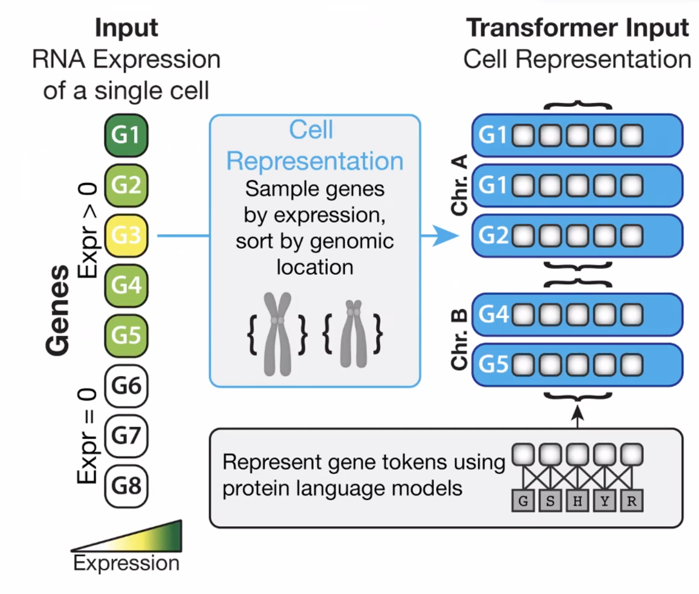
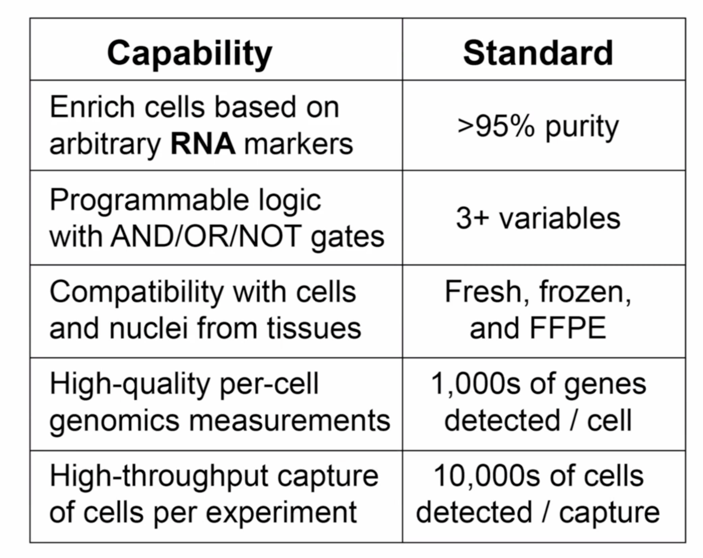

## Genome wide TF binding

### SHARE-Seq

In the aim of interpreting the footprint, in my words, to build a DNA footprint database --> trans-element
<-- DL (inspiyed by dl)

> How stable are the footprint as DNA are stable? \\
> can it output pleipotrip footprints? \\
> the scanning params (padding)

--> use case
identify TFs that drive cell aging --> nucleosomes shift

### 3D spatial from "raw" 2nd seq

--> 3D reconstruction based on more raw photonic data

--> expand the *in situ* seq by introducing the expanded hydrogel --> data on microns or DNA distance from lamin

> coupling with lamin to study the chromatin structure is a convention

inactive "X" as an exampled biology to be studied with this

### Sumamry of chromatin resolution and techs

### Discussion

ATAC replace ChIP
> but it's based on knowledge from ChIP

## open-ST

> 20,000 genes

from Nikolaus Rajewsky lab

"3D virtual tissue block" \\
module cell segment, module transcripts, map modules

### biological output

3D boundary between cell types, for example, tumor cells and other cells

### Discussion

- sequencing-based has more varied complexed noises. Ideal for hypothesis generating
- imaging-based is ideal for validating the hypothesis.
  
## Rare cell type by na cytometry based PERFF-seq

Coleb Lareau

### study strategy

> how much they are differ from other non-rare type?

Criteria for sucessful assay

Based on

1. RNA FISH
2. 10x Genomics Flex scRNA-seq, where cells are fixed
    > I didn't understand how seq on fixed cells bu two probes on one read

### benchmark using FC/RNA cytometry enrichment

### Biological output

1. enrich cells with TF expression
2. enrich with coding and ncRNA
3. rare cell types enrichment
4. FFEP and frozen tissues

### Discussion

1. easier with RNA vs DNA
2. initiate probes? ~ size of target gene
3. how many markers? limited by cell numbers but not markers

> I would say is the choice of orthogonal markers

## Single cell perturbation dictionaries

1. Chemical (cytokine stimulation)
   - Cui, wt al, Nature (2024)
    > I read this quite carefully already

2. Perturb-Seq
   - first cytokine stimulation
   - then fix and permeablize for perturb-seq (3 guides per gene for 40-60 genes)
  
### Analyzing

1. binarize perturbatoin output as in Nat Genet (2021)
2. imporve to continous score

## spatial and sc by Saturn and star-map

[github](https://github.com/wanglab-broad/spin)
[paper](https://www.biorxiv.org/content/10.1101/2023.06.30.547258v1)

### convention

1. smoothing *I missed how*
2. sc analysis
    neighbors are also spatial neighbors

### solution

1. **sample from multiple neighborhoods**
2. smoothing
3. sc analysis
